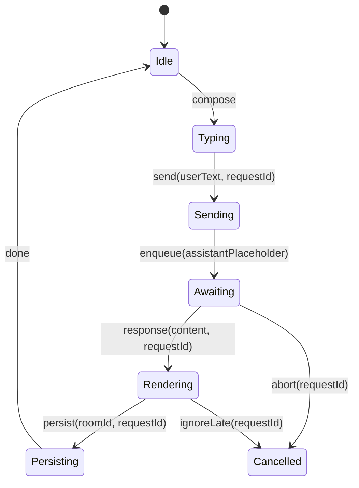

# State & Concurrency

## Message lifecycle (compose → send → stream → cancel/retry → persist → render)
1. compose: UI `ChatInput` collects text and drafts per room.
2. send: `useMessageActions.sendMessage` → `sendMessageHandler` → `MessageSenderService`.
3. stream: currently not streaming; UI uses `TypewriterText` for local animation after full content.
4. cancel/retry: `RetryService` handles retries; no cancel/abort wiring.
5. persist: Supabase writes for messages; optional room creation when new.
6. render: `MessageList` renders, decides animation for last assistant or regenerated index.

## Race windows
- Navigate away during request; late response mutates state (no abort or ignore-late token).
- Regenerate while prior request in flight; both can write to same index.
- Room creation + message insertion retries without idempotency → duplicates.

## Ignore-late strategy
- Introduce `requestId`/`messageId` correlation; store in a map of active requests.
- On completion, only apply results if `activeRequests.has(requestId)` and index still matches.
- Cancel/clear on unmount or regeneration.

## Idempotency
- Thread `requestId` into DB writes; add unique constraint (user_id, request_id).
- For regeneration, use (room_id, original_message_id, request_id) to ensure single update.

## Single source of truth
- Create a `MessageStore` (hook + context) that owns messages and exposes intentful commands: `enqueueUser`, `applyAssistant`, `replaceAssistant(index)`, `markTyping`, `completeTyping`.
- Services emit events: `ResponseReceived(requestId, content)`, `Persisted(roomId, ids)`; store reduces events into state.

## Minimal event/state diagram

