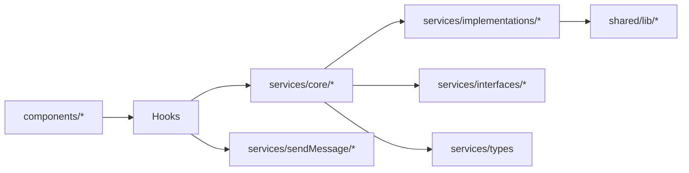

# Dependency Graph & Cycles

Based on static inspection of `src/features/chat` (consolidated replacement for `concurrent-chat`). No hard cycles detected among services/hooks.

## Module graph (high-level)

## Potential risky couplings
- Barrels (`index.ts`) in `services/`, `hooks/messages` can hide dependencies and encourage wide imports.
- `MessageSenderService` depending on `INavigationService` mixes domain with navigation concerns.

## Cycle candidates (no concrete cycle found)
- Hooks → Services → Hooks (via callbacks) avoided, but watch for:
  - hooks/messages/useMessageActions → sendMessageHandler → ServiceFactory → MessageSenderService → ReactUIStateService → handleMessageState → setMessages (hook-provided) [linear; not cyclic].

## Suggestion
- Keep barrels but avoid deep `export *` fan-out; prefer explicit re-exports. Add CI rule to detect cycles (madge / dependency-cruiser) and forbid UI→persistence imports.
