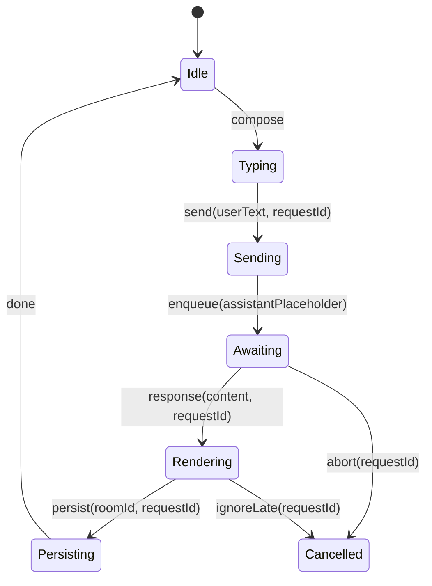
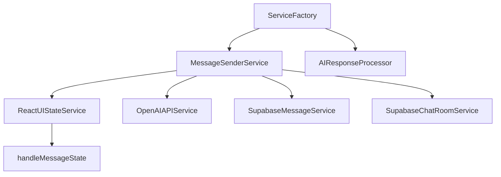

# Diagrams

## Message Lifecycle


## High-level Architecture
```mermaid
flowchart LR
  UI[UI components]\nMessageList/ChatInput --> Hooks
  Hooks --> Orchestrators[useMessagesCombined]
  Orchestrators --> ServicesCore[MessageSenderService, RetryService, AIResponseProcessor]
  ServicesCore --> Implementations[OpenAIAPIService, ReactUIStateService, Supabase*]
  Implementations --> Persistence[Supabase]
  Implementations --> Navigation[Expo Router]
```

## Import Graph (services)

